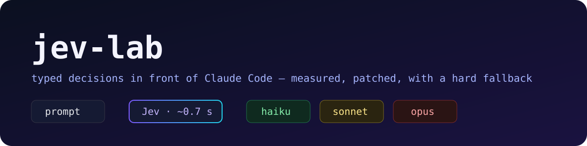
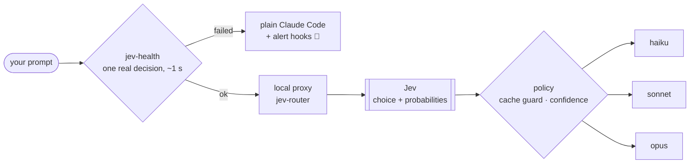

<p align="center"></p>

<p align="center">
  
  
  
  
  
</p>

# jev-lab

An open lab for using **[Jev](https://docs.typesafe.ai)** *correctly* next to **Claude Code**.

Jev is TypeSafe's *System One* model: you give it a state and typed questions, it returns values **from your own schema** with probabilities, in well under a second, for about US$ 0.00001 per decision. It does not write text. That makes it a different kind of building block: a **decision layer**, not a cheaper chatbot.

Saving tokens is a side effect. The point of this lab is to learn **where a typed decision belongs, where it does not, and how to find out when it silently stopped working**.

> [!IMPORTANT]
> Independent project. Not affiliated with TypeSafe, Anthropic, or [`jev-router`](https://github.com/gargpratyush/jev-router), which this lab builds on.

## What is in here

| | |
| --- | --- |
| 🧠 [Using Jev the right way](docs/00-using-jev-well.md) | the decision-layer pattern, question design, thresholds, what Jev must never decide alone |
| 🔬 [Two silent bugs and the patch](docs/01-bugs-and-patch.md) | root cause measured with `JEV_DUMP`, A/B proof, relation to the upstream PRs |
| 🛟 [Hard fallback and alerts](docs/02-fallback.md) | the health gate, what it covers, what it does not |
| 🧪 [Testing on a budget](docs/03-testing.md) | verify by transcript, never by status line |
| 🧭 [Case study: a long session](docs/04-long-session.md) | Jev wanted Haiku on top of 760k cached tokens, and why that matters |
| 📚 [Lessons from the ecosystem](docs/05-ecosystem-lessons.md) | what the issues of the fastest-growing Jev repos already taught |
| ⚠️ [Known risks](docs/06-risks.md) | read before using this for serious work |
| 📊 [Where the tokens actually go](docs/07-where-the-tokens-go.md) | 78% of tokens in 6 giant sessions, 1% where a router can act; what the 76k baseline is made of |
| 🚦 [Experiment 2: completion gate](docs/08-completion-gate.md) | Jev judging acceptance criteria in shadow mode, live results and a flaw already found |
| 🗺️ [Roadmap](docs/09-roadmap.md) | Jev as the control plane of an orchestrator: five functions, status and risk |

> [!NOTE]
> **The finding that reframed this lab:** over 7 days, 78% of one developer's tokens were read by 6 giant sessions, and the sessions where a per-turn router makes decisions that stick added up to **1%**. Routing works; it is just not where the spend is. [Details](docs/07-where-the-tokens-go.md).

## The first experiment: per-turn model routing

Same prompt (`say only: ok`), same Jev answer (`p=0.99` for Haiku), three situations:

| Situation | Stock jev-router 0.3.0 | With the patch |
| --- | --- | --- |
| Empty folder, `-p` mode | 🔴 Opus, no decision recorded | 🟢 `opus → haiku` |
| Project with a 145 KB `CLAUDE.md` (ctx ~46k) | 🔴 Opus, `downgrade-not-worth-cache-rebuild` | 🟢 `opus → haiku` |
| Long session (760k+ cached tokens) | 🟢 Opus kept | 🟢 Opus kept, the cache guard still applies |

Both bugs were **silent**: the status line showed up, the proxy rewrote the model, and everything went to Opus.

## How it works



1. **`jev-health`** asks Jev one real question before the session opens. It passes only on HTTP 200 **and** a typed `choice` in the answer.
2. Passed: `jev-claude` starts the proxy and Jev picks the tier of every fresh turn.
3. Failed: Claude Code opens **without** routing, with hooks that warn on every message and fire a system notification. Routing that is off without anyone noticing is the worst case; here it cannot happen at session start.

## Install

Requirements: a logged-in Claude Code, Node 20.12+, [`jev-router`](https://github.com/gargpratyush/jev-router) **0.3.0**, and a TypeSafe key.

```sh
git clone https://github.com/Pasblinn/jev-lab && cd jev-lab
printf 'JEV_API_KEY=%s\n' "<your key>" > ~/.jev-router.env && chmod 600 ~/.jev-router.env
./install.sh
jev
```

| Command | Role |
| --- | --- |
| `jev` | Terminal launcher: health gate, then router or fallback |
| `jev-health` | The gate. Exit 0 only on a real decision; otherwise writes the reason to `~/.jev/DOWN` |
| `jev-down-hook` | Alert hook, loaded **only** on the fallback path via `--settings` |
| `jev-vscode-wrapper` | For `claudeCode.claudeProcessWrapper` in the VS Code extension |

None of this touches `~/.claude/settings.json`. Uninstall = delete the four files and restore `proxy.mjs.orig`.

## Lab principles

- **Find where the spend is before optimising anything.**
- **Deterministic rules first, Jev second, a strong model only for exceptions.**
- **Measure in transcripts and billed dollars**, never in status lines or cache percentages.
- **Jev's ranking is reliable; its absolute probability is not.** Thresholds copied from a README break in real use.
- **Every failure must be loud.**
- **Jev is never the sole authority** on anything destructive or irreversible.

## License

[MIT](LICENSE)
