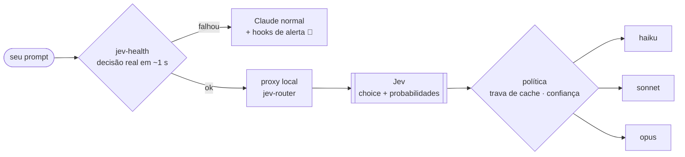

<p align="center"></p>

<p align="center">
  
  
  
  
  
</p>

# jev-lab

Laboratório aberto de uso do **[Jev](https://docs.typesafe.ai)** (o modelo *System One* da TypeSafe — devolve decisões tipadas com probabilidade, não texto) na frente do **Claude Code**, roteando cada turno para o modelo mais barato que dá conta.

Aqui não tem hype: tem **o que medimos, o que quebrou, o patch e a trava de segurança**.

> [!IMPORTANT]
> Projeto independente. Não é afiliado à TypeSafe, à Anthropic nem ao [`jev-router`](https://github.com/gargpratyush/jev-router), que é a base sobre a qual este lab roda.

## O resultado em uma tabela

Mesmo prompt (`diga apenas: ok`), mesmo Jev (`p=0.99` para Haiku), três situações:

| Situação | Sem o patch | Com o patch |
| --- | --- | --- |
| Pasta vazia, modo `-p` | 🔴 Opus — nenhuma decisão registrada | 🟢 `opus → haiku` |
| Projeto com `CLAUDE.md` de 145 KB (ctx ~46k) | 🔴 Opus — `downgrade-not-worth-cache-rebuild` | 🟢 `opus → haiku` |
| Sessão longa (760k+ tokens em cache) | 🟢 Opus mantido | 🟢 Opus mantido — a trava de cache continua valendo |

Os dois bugs eram **silenciosos**: a status line aparecia, o proxy reescrevia o modelo, e tudo saía em Opus.

## Como funciona



1. **`jev-health`** faz uma decisão real no Jev antes de abrir a sessão. Só passa com HTTP 200 **e** um `choice` tipado na resposta.
2. Passou → `jev-claude` sobe o proxy e o Jev escolhe o tier de cada turno novo.
3. Falhou → abre o Claude Code **sem** roteamento, com hooks que avisam em toda mensagem e disparam notificação do sistema. Roteamento desligado em silêncio é o pior cenário; aqui ele não existe.

## Instalação

Pré-requisitos: Claude Code logado, Node 20.12+, [`jev-router`](https://github.com/gargpratyush/jev-router) **0.3.0** e uma chave da TypeSafe.

```sh
git clone https://github.com/Pasblinn/jev-lab && cd jev-lab
printf 'JEV_API_KEY=%s\n' "<sua chave>" > ~/.jev-router.env && chmod 600 ~/.jev-router.env
./install.sh
jev
```

| Comando | Papel |
| --- | --- |
| `jev` | Lançador do terminal: health check → roteador, ou fallback |
| `jev-health` | A trava. Exit 0 só com decisão real; senão grava o motivo em `~/.jev/DOWN` |
| `jev-down-hook` | Hook de alerta, carregado **apenas** no fallback via `--settings` |
| `jev-vscode-wrapper` | Para `claudeCode.claudeProcessWrapper` na extensão do VS Code |

Nada disso toca em `~/.claude/settings.json`. Desinstalar = apagar os quatro arquivos e restaurar `proxy.mjs.orig`.

## Documentação

| | |
| --- | --- |
| 🔬 [Os dois bugs e o patch](docs/01-bugs-e-patch.md) | causa raiz medida com `JEV_DUMP`, A/B, relação com os PRs upstream |
| 🛟 [Fallback e alerta](docs/02-fallback.md) | desenho da trava, o que cobre e o que não cobre |
| 🧪 [Como testar gastando pouco](docs/03-como-testar.md) | o método de verificação por transcript, não por status line |
| 🧭 [Estudo de caso: sessão longa](docs/04-sessao-longa.md) | o Jev quis Haiku com 760k tokens em cache — e por que isso importa |
| 📚 [Lições do ecossistema](docs/05-licoes-do-ecossistema.md) | o que as issues dos repos que explodiram já ensinaram |
| ⚠️ [Riscos conhecidos](docs/06-riscos.md) | leia antes de usar em trabalho sério |

## Princípios do lab

- **Medir em transcript e em dólar faturado**, nunca em status line ou percentual de cache.
- **O ranking do Jev é confiável; a probabilidade absoluta não.** Threshold copiado de README quebra em uso real.
- **Toda falha precisa ser barulhenta.**
- **Jev nunca é autoridade única** em nada destrutivo ou irreversível.

## Licença

[MIT](LICENSE)
