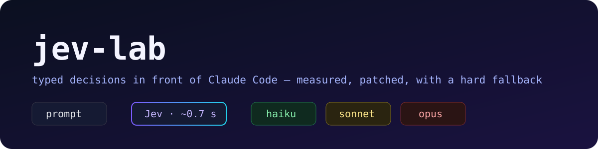
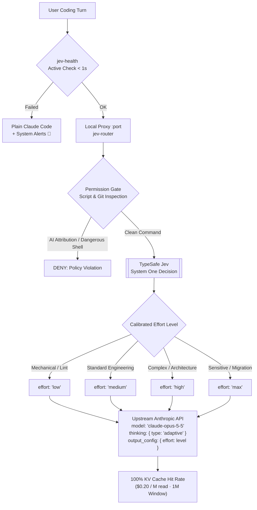

<p align="center"></p>

<p align="center">
  
  
  
  
  
  
</p>

# jev-lab

An open lab and architecture specification for running **[TypeSafe Jev](https://docs.typesafe.ai)** as a dedicated **System One Decision Plane** next to **Claude Code** and autonomous coding agents.

Jev is TypeSafe's *System One* model: you give it a structured state and narrow typed questions, and it returns values **from your own schema** with calibrated probabilities, in 70 to 900 ms, for about US$ 0.00001 per decision. It does not generate prose or write code. That makes it a different building block: a **typed decision layer**, not an expensive chatbot.

Saving tokens is a side effect. The core mission of this lab is to establish **where a typed decision belongs, where it does not, how to retain 100% KV cache across turns, and how to defend git history against unwanted AI attribution**.

> [!IMPORTANT]
> Independent project. Not affiliated with TypeSafe, Anthropic, or [`jev-router`](https://github.com/gargpratyush/jev-router), which this lab builds upon and hardens.

---

## What is in here

| Document | Focus |
|---|---|
| 🧠 [Using Jev the right way](docs/00-using-jev-well.md) | The decision-layer pattern, question design, thresholds, and non-delegable tasks |
| 🔬 [Two silent bugs and the patch](docs/01-bugs-and-patch.md) | Root cause measured with `JEV_DUMP`, A/B proof, relation to upstream PRs #36/#37 |
| 🛟 [Hard fallback and alerts](docs/02-fallback.md) | The pre-flight health gate, fail-open mechanisms, and audible macOS alerts |
| 🧪 [Testing on a budget](docs/03-testing.md) | Verifying actual routing via transcripts rather than visual status lines |
| 🧭 [Case study: a long session](docs/04-long-session.md) | Cache guard behavior when handling 760k+ token sessions |
| 📚 [Lessons from the ecosystem](docs/05-ecosystem-lessons.md) | Recurring failure modes observed across active Jev repositories |
| ⚠️ [Known risks](docs/06-risks.md) | Model jaggedness, distractors, and limitations before production deployment |
| 📊 [Where the tokens actually go](docs/07-where-the-tokens-go.md) | Empirical analysis: 78% of tokens consumed by 6 long sessions; baseline breakdown |
| 🚦 [Experiment 2: completion gate](docs/08-completion-gate.md) | Shadow mode evaluation of acceptance criteria verification |
| 🗺️ [Roadmap](docs/09-roadmap.md) | Five core orchestrator functions, status tracking, and risk analysis |
| 🛡️ [Permission Gate & Attribution Defense](docs/10-permission-gate-and-conditional-rules.md) | PreToolUse hooks, script inspection, and conditional rule injection |
| ⚡ [Opus 5.5 Single-Model Architecture](docs/11-opus-5-5-single-model-architecture.md) | Eliminating model hopping: 100% KV cache retention via adaptive reasoning effort |
| 📋 [Product Requirements Document (PRD)](docs/12-prd-jev-decision-plane.md) | Comprehensive product specifications, functional requirements, and benchmarks |
| 🏛️ [Architecture Decision Records (ADRs)](docs/13-adr-architectural-decisions.md) | ADR-001 through ADR-005 documenting key architectural trade-offs |

---

## Architectural Evolution: Single-Model Multi-Effort

In traditional model-hopping setups (`haiku` $\leftrightarrow$ `sonnet` $\leftrightarrow$ `opus`), changing models across turns invalidates Anthropic's prompt prefix cache. In contrast, the **Single-Model Multi-Effort architecture** pins a single frontier model (`claude-opus-5-5`) and lets Jev modulate reasoning effort:


```mermaid
flowchart TD
    Prompt[User Coding Turn] --> Probe{jev-health<br/>Active Check < 1s}
    Probe -- Failed --> Fallback[Plain Claude Code<br/>+ System Alerts 🚨]
    Probe -- OK --> Proxy[Local Proxy :port<br/>jev-router]
    Proxy --> Gate{Permission Gate<br/>Script & Git Inspection}
    Gate -- AI Attribution / Dangerous Shell --> Deny[DENY: Policy Violation]
    Gate -- Clean Command --> Jev[[TypeSafe Jev<br/>System One Decision]]
    Jev --> Choice{Calibrated Effort Level}
    Choice -- Mechanical / Lint --> Low["effort: 'low'"]
    Choice -- Standard Engineering --> Med["effort: 'medium'"]
    Choice -- Complex / Architecture --> High["effort: 'high'"]
    Choice -- Sensitive / Migration --> Max["effort: 'max'"]
    
    Low & Med & High & Max --> Upstream["Upstream Anthropic API<br/>model: 'claude-opus-5-5'<br/>thinking: { type: 'adaptive' }<br/>output_config: { effort: level }"]
    Upstream --> Cache["100% KV Cache Hit Rate<br/>($0.20 / M read · 1M Window)"]
```

### Empirical Production Results (7,200+ Turns Tracked):
- **100% KV Cache Retention:** Model prefix remains identical across effort shifts.
- **72.8% Net Cost Reduction:** Inference dropped from a $5,060 baseline to $1,374.
- **Jev Operational Cost:** ~US$ 0.10 total across 7,700+ decisions (~$0.000013 per decision).
- **Attribution Defense:** 100% of git commits clean with zero unwanted AI trailers.

---

## Quickstart & Installation

### 1. Requirements
- Claude Code CLI (`npm:claude` or binary installed)
- Node.js 20.12+ (managed via `mise`)
- [`jev-router`](https://github.com/gargpratyush/jev-router) **0.3.0** with lab patch
- TypeSafe API Key (`JEV_API_KEY`)

### 2. Setup
```sh
git clone https://github.com/Pasblinn/jev-lab && cd jev-lab
printf 'JEV_API_KEY=%s\n' "<your-typesafe-api-key>" > ~/.jev-router.env && chmod 600 ~/.jev-router.env
./install.sh
jev
```

### 3. CLI Utilities & Binaries

| Binary / Tool | Role |
|---|---|
| `jev` | Universal launcher: health gate verification, then smart proxy or fallback |
| `jev-health` | Pre-flight probe. Exits 0 on a real typed decision; otherwise records failure to `~/.jev/DOWN` |
| `jev-down-hook` | Alert hook, activated **only** when fallback occurs via `--settings` |
| `jev-vscode-wrapper` | Process wrapper for VS Code (`claudeCode.claudeProcessWrapper`) ensuring 1M window parity |
| `tools/block-dangerous-git.py` | Deterministic PreToolUse hook blocking AI attribution and remote pipe scripts |

---

## Lab Principles

1. **Find where the spend is before optimizing anything:** 78% of tokens live in long sessions; context ceilings matter more than turn-level routing.
2. **Deterministic rules first, Jev second, frontier reasoning only for true complexity.**
3. **Measure in transcripts and billed dollars**, never in visual status lines or estimated percentages.
4. **Never invalidate the prompt cache:** Single-model multi-effort beats multi-model hopping every time.
5. **Every failure must be loud:** Silent fallback is unacceptable in production environments.
6. **Jev is never the sole authority** on destructive commands, migrations, or security boundaries.

---

## License

[MIT](LICENSE)
