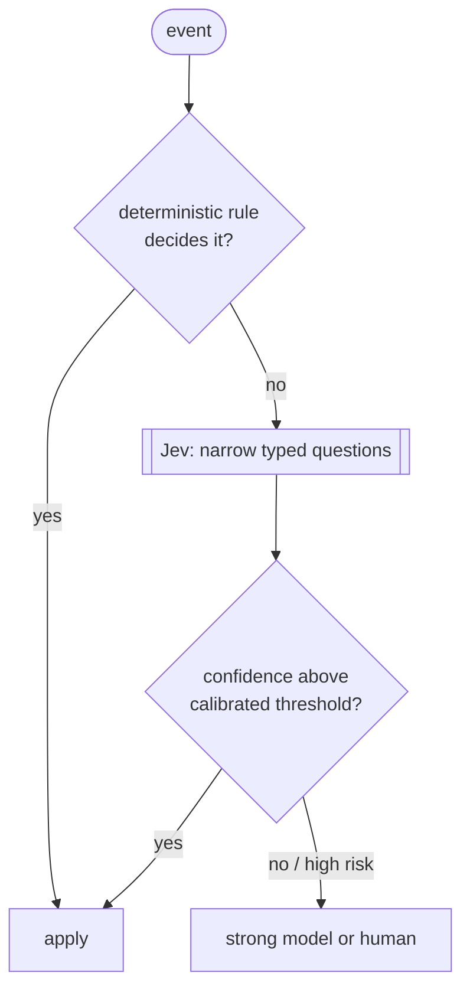

# 🧠 Using Jev the right way

Jev is powerful because of what it **refuses** to do. It cannot ramble, cannot return a value outside your schema, and answers in 70 to 900 ms for a fraction of a cent. The mistake is to treat it as a cheap LLM. It is a **typed decision function with calibrated uncertainty**.

Verified on this machine against `jev-1.13.0`:

```json
{ "answers": { "route": { "type": "choice", "choice": "cheap",
    "probabilities": { "cheap": 1, "strong": 0 }, "confidence": 1 } },
  "usage": { "input_tokens": 317, "output_tokens": 31, "cost": 0.000013314 } }
```

Same question with a vague four-field state: `confidence 0.33`. **A poor state does not become a good decision.**

## The three primitives

| Primitive | Returns | Good for |
| --- | --- | --- |
| `choice` | one option + probability per option + `confidence` | routing, triage, next action |
| `score` | a level on an ordered rubric | complexity, severity, quality |
| `noul` | probability of "yes" (0 to 1), no separate confidence | gates, guards, "is this still needed?" |

Limits: 64k tokens per request, 32k for state plus the longest question, text only, US$ 0.042 per million input tokens, output free.

## The decision-layer pattern



Jev absorbs the repetitive micro-decisions so the expensive model only sees exceptions. Where it fits in an agent stack:

| Decision | Primitive | Without Jev |
| --- | --- | --- |
| Which worker or tier takes this task? | `choice` | the strong model picks, every time |
| Is the worker's evidence enough to accept? | `noul` | the strong model rereads the context |
| Retry, retry harder, explore, or escalate? | `choice` | a human or the strong model |
| Does this touch a critical area? | `noul` / `score` | regex, or nothing |
| Is this tool result still needed in context? | `noul` | lossy LLM summary |

## Design rules

1. **Ask several narrow questions, never one giant one.** `route`, `risk`, `needs_architecture_review`, `worker_is_blocked`, `acceptance_evidence_sufficient`, `next_action` are six independent answers in one request.
2. **Send a minimal state.** Objective, acceptance criteria, affected areas, file count, risk flags, prior attempts, a test summary, a diff summary capped at ~1000 chars. Never the repository. Never secrets.
3. **Rules beat Jev.** Anything a deterministic rule can decide must not reach Jev.
4. **Calibrate thresholds on your own data.** Starting points that must be re-measured: auto-route 0.90, auto-accept 0.94, auto-retry 0.90, escalate 0.85, fall back below 0.75. Every project that shipped a fixed threshold from a README hit a bug ([lessons](05-ecosystem-lessons.md)).
5. **Trust the ranking more than the number.** Compare options against each other before comparing against a constant.
6. **Fail open to a conservative route, and fail loudly.** A Jev outage must not stop the pipeline, and must not go unnoticed.
7. **Know what Jev sees.** It judges the text you send, not the work behind it ([case study](04-long-session.md)).

## What Jev must never decide alone

Irreversible deletes, destructive migrations, auth changes, payments, permissions, secrets, production, destructive infrastructure. There: objective checks **plus** Jev as one signal **plus** a strong model, **plus** a human where policy requires.

TypeSafe documents the weak spots itself: arithmetic, dates, distractors, adversarial state ([jaggedness](https://docs.typesafe.ai/model-jaggedness/jev-1.13)). A schema-valid answer is not a correct answer.

## Status of this document

The routing row is **measured** in this lab. The other rows are the design this lab is working toward, based on a private orchestrator that already routes, gates completion and drives a retry ladder through Jev with a deterministic fallback. Each one gets its own measured write-up as it lands here.
