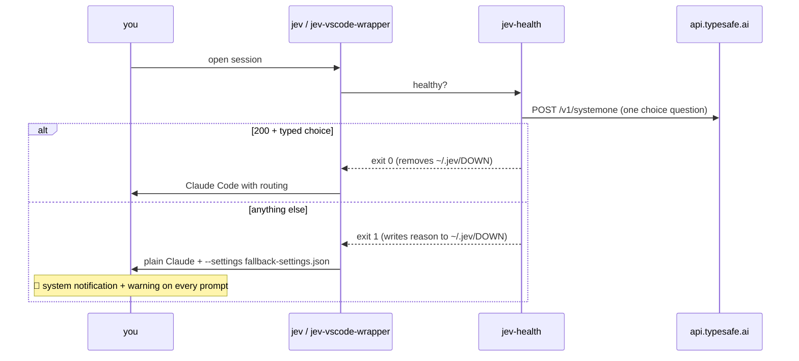

# 🛟 Hard fallback and alerts

Requirement: if Jev is not working, drop to plain Claude Code, but only when the failure is **certain**, and **say so loudly**. Routing that is off in silence is expensive and nobody notices.



## The gate (`jev-health`)

Passes **only** if: the `jev-claude` shim exists · `~/.jev-router.env` is readable and has `JEV_API_KEY` · HTTP 200 within 6 s · the answer contains a typed `choice`. Cost: ~1.1 s and ~US$ 0.00001 per session. The key reaches `curl` through stdin (`--config -`), so it never shows up in `ps`.

## The alert (`jev-down-hook`)

Loaded only on the fallback path, via `--settings`. It does **not** modify `~/.claude/settings.json`, so other clients (Desktop, plain `claude`) stay untouched and act as the rollback point.

- `SessionStart`: macOS notification with sound + `systemMessage`.
- `UserPromptSubmit`: `systemMessage` + an instruction for the model to open its reply with the warning.

## Tested

| Scenario | Result |
| --- | --- |
| key file removed, `jev -p` | plain Claude opened; the reply started with **"JEV IS DOWN … Reason: ~/.jev-router.env missing"** |
| same, VS Code wrapper (stream-json) | same warning, user's default model |
| key restored | flag removed, `opus -> haiku p=1.00` |

## Long sessions step aside

The VS Code wrapper reads the last recorded context of a resumed session (`--resume <id>` → transcript usage).
Above `JEV_MAX_RESUME_CONTEXT` (default 150k tokens) it launches plain Claude Code, no proxy, no alert: on a
long session the cache guard pins the tier anyway ([case study](04-long-session.md)), so routing adds only risk.
`JEV_WRAPPER_DRYRUN=1` prints the decision without launching:

```
new session:    mode=jev                 context=0
small resumed:  mode=jev                 context=39119
long resumed:   mode=plain-long-session  context=914155
```

## What it does NOT cover

A failure **in the middle** of a session. `jev-router` treats a Jev error as "keep the current tier" and carries on. There is no alert for that yet.
