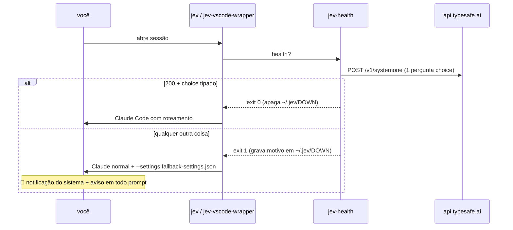

# 🛟 Fallback e alerta

Requisito: se o Jev não funcionar, cair no Claude normal — mas só quando houver **certeza** da falha, e **avisar alto**, porque roteamento desligado em silêncio custa caro e ninguém percebe.

## A trava (`jev-health`)

Passa **somente** se: shim do `jev-claude` existe · `~/.jev-router.env` legível com `JEV_API_KEY` · HTTP 200 em até 6 s · resposta contém um `choice` tipado. Custo: ~1,1 s e ~US$ 0,00001 por sessão. A chave vai para o `curl` por stdin (`--config -`), então não aparece em `ps`.

## O alerta (`jev-down-hook`)

Carregado só no caminho de fallback, via `--settings` — **não altera** `~/.claude/settings.json`, então outros clientes (Desktop, `claude` puro) ficam intocados e servem de ponto de rollback.

- `SessionStart`: notificação do macOS com som + `systemMessage`.
- `UserPromptSubmit`: `systemMessage` + instrução para o modelo abrir a resposta avisando.

## Testado

| Cenário | Resultado |
| --- | --- |
| env da chave removido, `jev -p` | abriu Claude normal; resposta começou com **"JEV FORA DO AR … Motivo: ~/.jev-router.env ausente"** |
| idem, wrapper do VS Code (stream-json) | mesmo aviso, modelo padrão do usuário |
| chave restaurada | flag removida, `opus -> haiku p=1.00` |

## O que NÃO cobre

Falha **no meio** da sessão. O proxy do `jev-router` trata erro do Jev como "mantém o tier atual" e segue. Não há alerta para isso ainda.
