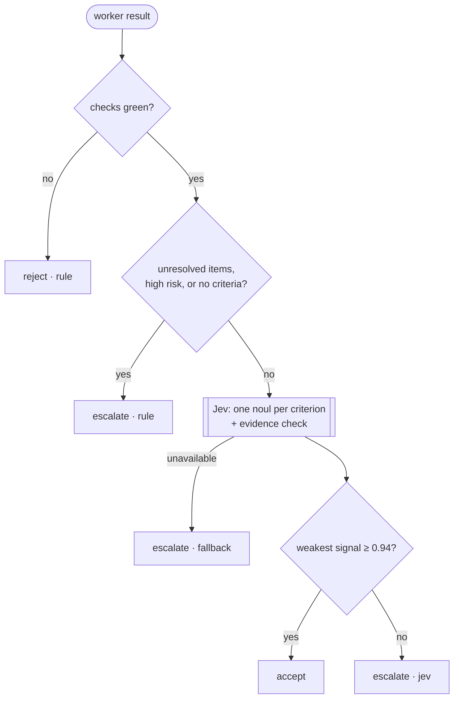

# 🚦 Experiment 2: a completion gate, in shadow mode

**Question:** when a worker agent says "done", can Jev decide that the acceptance criteria were met, so the strong model is not woken up just to read a summary and say "ok"?

Code: [`experiments/completion-gate/`](../experiments/completion-gate). Status: **shadow only**. It records what it would have decided next to what really happened. It never changes an outcome.



Design choices, each one a rule from [doc 00](00-using-jev-well.md):

- **Rules first.** Red checks, unresolved items, high-risk tasks and missing criteria never reach Jev.
- **One narrow `noul` per acceptance criterion**, not a single "is it done?".
- **The weakest answer decides.** A missing answer counts as 0, never as a pass.
- **An outage escalates. It never accepts.**
- **Minimal state:** the objective and the worker's structured report. No repository, no secrets.

## Live results

Three synthetic cases against `jev-1.13.0`, four consecutive runs, spread ±0.02:

| Case | Verdict | Per-criterion | `evidence_concrete` | Latency |
| --- | --- | --- | --- | --- |
| Solid report (files + regression test + green checks) | `accept` | 0.97 / 0.98 | 0.95 to 0.96 | ~780 ms |
| Claims the fix, no test evidence | `escalate` | 0.34 / 0.19 | 0.93 to 0.94 | ~720 ms |
| Did a different task entirely | `escalate` | 0.05 / 0.08 | 0.84 | ~290 ms |

## The flaw we already found

`evidence_concrete` barely discriminates: **0.95 for the good report, 0.93 for the bad one, both sitting on the 0.94 threshold.** The per-criterion questions do all the work (0.97 vs 0.34). As written, that question only adds the risk of escalating a good report over 0.01. It is the ecosystem's recurring bug in miniature: a fixed threshold on a poorly calibrated question ([lessons](05-ecosystem-lessons.md)). Left in on purpose, for the shadow data to confirm before it is changed.

## Shadow ledger

`recordShadow()` appends `{gate verdict, actual outcome}` as JSONL; `shadowReport()` returns agreement, **false accepts** (the only disagreement that would have cost something) and the number of tasks that would have been closed without the strong model.

> [!NOTE]
> Three hand-written cases show the mechanism works. They say nothing about whether 0.94 is right for real tasks. The plan is 20 to 30 judged real tasks before the gate is allowed to accept anything.

## Run it

```sh
cd experiments/completion-gate && npm install && npm test
JEV_API_KEY=... npm run test:live
```
