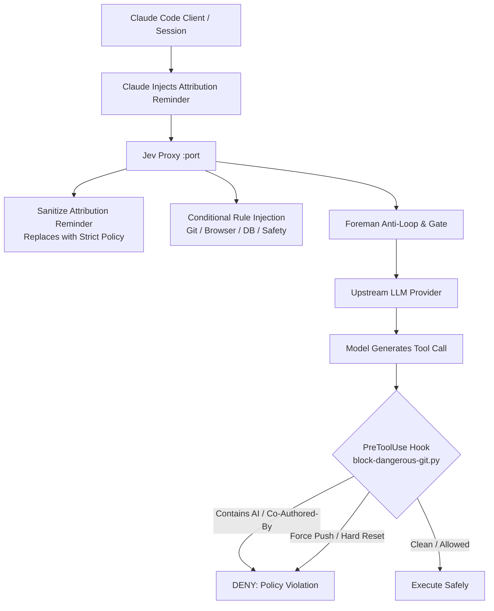

# 🛡️ Permission Gate, Attribution Defense & Conditional Rule Injection

**Context:** Claude Code includes internal guidance and dynamic `<system-reminder>` blocks prompting models to append attribution trailers (`Co-Authored-By: Claude...` and `🤖 Generated with [Claude Code]`) to git commits and PR descriptions. In long conversations or when turns are routed to faster tiers, models obey these recent reminders over distant system instructions, violating the user's explicit rule in `CLAUDE.md` and `AGENTS.md`:
> *"NUNCA mencione IA (Claude, Codex, Copilot) em commits, código ou docs. Sem trailer Co-Authored-By para ferramentas de IA."*

Based on Jev creator Diogo Almeida's advanced agent patterns (**Use Case 1: Permission Gate** and **Use Case 7: Conditional AGENTS.md / CLAUDE.md**), we implemented a multi-layered defense.



---

## 1. Multi-Layer Defense Architecture

### Layer 1: Deterministic PreToolUse Hook (`block-dangerous-git.py`)
- Located at `~/.claude/hooks/block-dangerous-git.py`.
- Intercepts all `Bash` tool calls prior to execution.
- Checks if the command invokes `git commit` (via flags `-m`, heredocs, or `-F / --file`).
- Regex matches `Co-Authored-By`, `noreply@anthropic.com`, `🤖`, `generated with claude`, or direct AI mentions (`Claude`, `Codex`, `Copilot`, `ChatGPT`, etc.).
- Deterministically denies execution with a descriptive reason before git can record the commit.
- **Script Content Inspection (Diogo Almeida Thing 05)**: When executing scripts (`bash *.sh`, `sh *.sh`, `python *.py`), the hook parses the script file on disk and inspects its content before execution. Blocks remote script piping (`curl | sh`), destructive unconstrained removals (`rm -rf /`), embedded force-pushes, or AI commit trailers embedded within scripts.

### Layer 2: In-Flight Prompt Sanitization (`foreman.mjs`)
- Strips and neutralizes Claude Code's internal `<system-reminder>` blocks containing git attribution instructions in `body.messages`.
- Injects a strict reminder reinforcing zero AI attribution:
  ```
  <system-reminder>[STRICT POLICY - CLAUDE.md / AGENTS.md]
  - NEVER mention AI (Claude, Codex, Copilot) in git commits, pull requests, code, or documentation.
  - NEVER add 'Co-Authored-By' trailers or attribution tags.
  - All commits must follow Conventional Commits in English.
  </system-reminder>
  ```

### Layer 3: Conditional Rule Injection (Use Case 7)
- Rather than bloating every request with the entire rulebook, Jev dynamically detects active task domains and injects only the required rules into the immediate turn context:
  - **Git & Version Control**: Injected when git, commits, branches, or PRs are touched. Enforces clean commits and worktree isolation.
  - **Browser Verification**: Injected when UI, frontend, components, or screens are modified. Enforces headless Chrome for Testing and visible condition waits.
  - **Database & SQL**: Injected when queries, migrations, or database tools are detected. Enforces parameterized queries and embedded-postgres testing.
  - **Destructive Operations**: Injected when `rm`, `clean`, `reset`, or `drop` are present. Enforces explicit confirmation and git status checks.

### Layer 4: Permission Gate (Use Case 1)
- Supervisory evaluations in `foreman.mjs` assess tool safety before routing and emit audit events to `~/.jev/audit/events.jsonl` under `dimension: "permission_gate"`.

### Layer 5: Context Window Architecture (1M Opus/Fable + Isolated Haiku Gate)
- **High-Capacity Master Tiers (1M Tokens)**:
  - `claude-opus-5` and `claude-fable-5-1` are configured with `maxContext: 1,000,000` tokens and `CONTEXT_WINDOW_TOKENS = 1,000,000`.
  - Claude Code environment variables (`CLAUDE_CODE_MAX_CONTEXT_TOKENS: "1000000"`, `CLAUDE_CODE_AUTO_COMPACT_WINDOW: "800000"`) enable sessions on Opus/Fable to retain massive histories up to 1M without premature compaction.
- **Hard Window Gate for 200k Models (Haiku / Sonnet)**:
  - In `policy.mjs`, when `contextTokens > 160,000`, routing down to 200k models (Haiku or Sonnet) in the main thread is strictly forbidden (`reason: "context-exceeds-200k-window"`). The session is clamped to Opus/Fable to prevent upstream HTTP 400 errors.
- **Isolated Dispatch for Haiku**:
  - Haiku is dispatched strictly in isolated tasks / subagents with small initial payloads (`contextTokens < 20,000`), executing mechanical and trivial tasks in ~300ms at minimal cost without polluting or invalidating the main session prompt cache.

### Layer 6: Route by Trust and Sensitivity (Diogo Almeida Thing 06)
- Tasks involving sensitive assets (secrets, `.env`, tokens, passwords), production environments (VPS, deploy, release), or database migrations are strictly locked to frontier models (`claude-opus-5` or `fable`).
- Prevents weaker or cheaper third-party models from handling sensitive or infrastructure-altering operations, while allowing trivial documentation, syntax, or isolated formatting tasks to utilize fast tiers safely.

---

## 2. Verification & Test Evidence

- **Unit Tests:** `node --test test/improvements.test.mjs`
  - 10/10 tests passing (Shadow Mode, Loop Guard identical calls, Error count, Steering injection, Attribution sanitization, Conditional rules, Permission Gate, 1M Opus/Fable context window & isolated Haiku gate, Route by Trust & Sensitivity).
- **Harness Benchmark:** `s1 bench --runs 1`
  - 3/3 goals met (ship_cheapest, ship_fastest_gift, cancel_fraud) with 100% success rate and ~300ms latency.
- **Hook Tests:**
  - 15/15 test cases passing in safety suite (`block-dangerous-git.py`):
    - Blocked commit with `Co-Authored-By` trailer.
    - Blocked commit with explicit model mention.
    - Allowed clean conventional commit (`feat(router): add keepalive`).
    - Blocked `git push --force`.
    - Allowed non-destructive `git add`.
    - Blocked script containing `curl ... | sh`.
    - Blocked script containing `rm -rf /`.
    - Allowed benign shell script.
