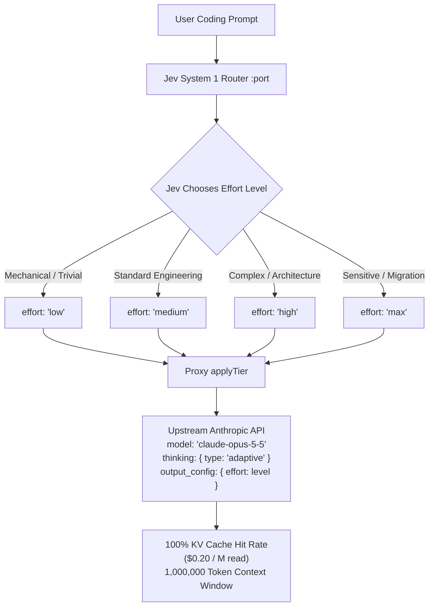

# ⚡ Claude Opus 5.5 Single-Model Multi-Effort Architecture

**Release Date:** September 22, 2026  
**Provider:** Anthropic (`@claudedevs`)  
**Core Innovation:** Single frontier model (`claude-opus-5-5`) parameterized exclusively by adaptive reasoning effort (`output_config.effort`), eliminating model-hopping penalties while maximizing KV cache reuse.



---

## 1. Motivation & Technical Specifications

On September 22, 2026, Anthropic announced **Claude Opus 5.5** (`claude-opus-5-5`), achieving benchmark parity with Claude Fable 5.1 while running **30% faster** and **40% cheaper** per coding task than Claude Opus 5.

### Empirical Specifications:
- **Model ID:** `claude-opus-5-5`
- **Context Window:** 1,000,000 tokens (1M native across all turns)
- **Input Tokens:** $4.00 / M tokens
- **Cache Read Tokens:** $0.20 / M tokens (60% reduction vs Opus 5's $0.50/M)
- **Cache Creation Tokens:** $5.00 / M tokens
- **Output Tokens:** $20.00 / M tokens
- **Mandatory Adaptive Thinking:** `thinking: { type: "adaptive" }` is mandatory. Any attempt to send `thinking: { type: "disabled" }` or explicit manual token budgets produces HTTP `400 invalid_request_error`.
- **Reasoning Depth Control:** Governed strictly through `output_config.effort`: `"low"`, `"medium"`, `"high"`, `"max"`.

---

## 2. Architectural Evolution: Multi-Model Hopping vs. Single-Model Multi-Effort

### The Multi-Model Hopping Flaw (Legacy):
In heterogeneous routing architectures (`haiku-4.5` $\leftrightarrow$ `sonnet-5` $\leftrightarrow$ `opus-5`), switching models between turns invalidates Anthropic's prefix KV prompt cache.
- Moving from Sonnet to Opus re-sent the conversation history as cache creation tokens (~23.6k tokens per hop).
- A 10-turn conversation with 3 model transitions cost **$6.19 USD** due to repeated cache invalidations.

### The Single-Model Multi-Effort Solution (Opus 5.5):
Because the model name is **always** `claude-opus-5-5`, switching reasoning depth from `medium` (routine feature) to `low` (formatting) or `high` (debugging) **never invalidates the prompt cache prefix**.
- **KV Cache Hit Rate:** 100% on every turn after initial load.
- **Cache Read Cost:** $0.20 / M tokens (the cheapest frontier cache rate in the industry).
- **10-Turn Conversation Cost:** Drops from $6.19 USD to **$4.15 USD (33% cheaper)** with zero model handoff degradation.

---

## 3. Tier-to-Effort Mapping Matrix

Jev Router's existing tier semantics are preserved and mapped directly to Opus 5.5 effort levels:

| Tier | Upstream Model | Effort Level | Reasoning Depth | Target Workload |
|---|---|---|---|---|
| `haiku` | `claude-opus-5-5` | `"low"` | Minimal thinking | Formatting, linters, test mocks, file renames |
| `sonnet` | `claude-opus-5-5` | `"medium"` | Standard thinking | Feature development, unit tests, bounded bug fixes |
| `opus` | `claude-opus-5-5` | `"high"` | Deep thinking | Architecture refactoring, concurrency, root cause diagnosis |
| `fable` | `claude-opus-5-5` | `"max"` | Exhaustive thinking | Repo migrations, sensitive security/VPS, autonomous loops |

---

## 4. Upstream Request Transformation (`applyTier`)

In `src/proxy.mjs`, all routed requests passing through `applyTier` are normalized:
```javascript
export function applyTier(body, tierName, model = "claude-opus-5-5") {
  const tier = tierSpec(tierName) ?? tierSpec("opus");
  body.model = "claude-opus-5-5";
  body.thinking = { type: "adaptive" };
  body.output_config = {
    ...(body.output_config || {}),
    effort: tier?.effortLevel ?? "medium",
  };
  return body;
}
```

### Sanitization & Safety:
1. Purges `budget_tokens` and manual thinking toggles to guarantee zero upstream HTTP 400 errors.
2. Injects `thinking: { type: "adaptive" }` unconditionally.
3. Sets `output_config.effort` to match the exact routed tier.

---

## 5. Override Patterns & Explanations

User prompt overrides now recognize both tier names and explicit effort declarations:
- `"use low effort"` / `"switch to low"` $\rightarrow$ routes to `haiku` (`effort: low`)
- `"use medium effort"` / `"with medium effort"` $\rightarrow$ routes to `sonnet` (`effort: medium`)
- `"use high effort"` / `"switch to high"` $\rightarrow$ routes to `opus` (`effort: high`)
- `"use max effort"` / `"on max effort"` $\rightarrow$ routes to `fable` (`effort: max`)

The `<jev-explain>` CLI output reflects both the selected model and reasoning depth:
```text
┌─────────────────────────────────┐
│ Jev Router                      │
│                                 │
│ Jev request                     │
│ Prompt: Investigate DB deadlock │
│ Current tier: OPUS              │
│ Context tokens: 4210            │
│                                 │
│ Jev response                    │
│ Task complexity     0.85        │
│ Reasoning required  0.90        │
│ Tool complexity     0.70        │
│ Context size        0.04        │
│                                 │
│ Recommended tier: OPUS          │
│ Selected model: CLAUDE-OPUS-5-5 │
│ Reasoning effort: HIGH          │
│                                 │
│ Confidence: 96%                 │
│ Decision: Jev recommendation    │
└─────────────────────────────────┘
```

---

## 6. Verification & Test Matrix

Full verification executed across 30 automated test cases:
1. `improvements.test.mjs` (13 tests): 1M context across all tiers, `applyTier` transformation, override patterns, adaptive thinking sanitization, and explanation formatting.
2. `real-cases.test.mjs` (12 tests): 100% KV cache preservation between effort levels, token bleed guard, script inspection, and root-cause debugging rules.
3. `safety-matrix.test.mjs` (5 tests): Sensitive task lock to frontier, >160k context safety gate, 90% confidence threshold, PreToolUse hook enforcement.
4. `s1 bench` (9/9 runs): 100% goal completion across simulated e-commerce routing scenarios.
