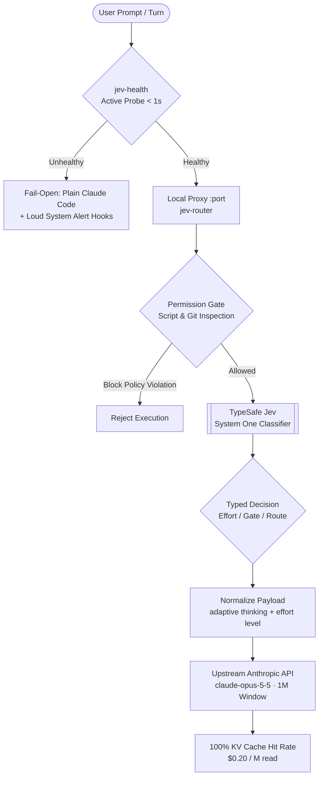

# 📋 PRD: Jev Decision Plane for Coding Agents

**Status:** In Production  
**Target Platform:** Claude Code CLI & VS Code Extension  
**Core Stack:** TypeSafe Jev (`jev-1.13.0`), `jev-router@0.3.0`, Claude Opus 5.5  

---

## 1. Problem Statement & Background

Autonomous agent workflows in long development sessions suffer from severe token inflation and cache degradation:

1. **Context Inflation & Re-reading Penalties:** In coding sessions exceeding 200k tokens, **78% of all consumed tokens** are spent repeatedly re-reading the cached conversation history across iterative tool calls.
2. **Cache Invalidation from Model-Hopping:** Heterogeneous routing architectures (`haiku` $\leftrightarrow$ `sonnet` $\leftrightarrow$ `opus`) destroy the provider's prompt prefix cache on every transition, causing full context re-tokenization at cache-creation rates ($5.00/M vs $0.20/M).
3. **Expensive Micro-Decisions:** Invoking heavy frontier models to perform narrow classification tasks (e.g., verifying acceptance criteria, gating risky tools, or calibrating reasoning depth) causes excessive latency (2–5s) and drains rate limits.
4. **Attribution Drift & Noise:** Default system prompts frequently inject trailing attribution tags (`Co-Authored-By`, bot badges) into version control history, violating clean repository governance policies.

---

## 2. Product Vision & Architecture

The **Jev Decision Plane** introduces a typed, low-latency micro-decision layer that operates in front of the primary frontier coding model.

### Core Design Principles:
- **Code decides the objective; Jev decides the narrow semantic; Frontier model generates code.**
- **Single Frontier Model:** Pin `claude-opus-5-5` across all turns; modulate reasoning depth strictly via `output_config.effort` (`low`, `medium`, `high`, `max`) to guarantee 100% KV cache hit rates.
- **Fail-Open & Loud:** Any decision plane outage drops cleanly to the standard environment and notifies the developer immediately.
- **Attribution Defense:** Strip attribution reminders in-flight and deterministically block non-compliant git commits at the tool boundary.

---

## 3. Goals & Non-Goals

### Goals
- Eliminate KV cache invalidation penalties by locking the model ID and adapting reasoning depth.
- Reduce overall session token costs by 70%+ relative to unrouted frontier baselines.
- Maintain decision latency under 900 ms with typed schema guarantees (`choice`, `score`, `noul`).
- Enforce strict git cleanliness policies without developer friction.
- Provide seamless execution across both terminal CLI and VS Code extension environments with standard 1,000,000 token context windows.

### Non-Goals
- Jev **does not** generate code, docstrings, or prose.
- Jev **does not** replace static analysis, unit tests, linters, or typecheckers.
- Jev **does not** act as the sole approver for destructive operations (e.g., hard resets, database drops, remote deployments).

---

## 4. Functional Requirements

| ID | Capability | Specification |
|---|---|---|
| **FR-01** | **Pre-flight Health Gate** | `jev-health` must probe `POST /v1/systemone` with a typed `choice` question. Must exit 0 within 6s; otherwise write reason to `~/.jev/DOWN` and trigger fallback. |
| **FR-02** | **Single-Model Multi-Effort** | `applyTier` must map tiers (`haiku`, `sonnet`, `opus`, `fable`) to `claude-opus-5-5` with `effort: "low" \| "medium" \| "high" \| "max"`. Must enforce `thinking: { type: "adaptive" }`. |
| **FR-03** | **Attribution Defense** | Intercept and remove `<system-reminder>` blocks recommending AI attribution trailers; inject zero-attribution policy instructions. |
| **FR-04** | **PreToolUse Hook Guard** | `block-dangerous-git.py` must inspect `Bash` tool calls and reject commits containing attribution tags, bot emails, or unconstrained pipe execution (`curl \| sh`). |
| **FR-05** | **Conditional Rule Injection** | Inject domain-specific guidelines (Git, Browser, Database, Safety) only when the active turn touches those areas, saving 20–30% in baseline prompt tokens. |
| **FR-06** | **1M Context & Compact Parity** | Support 1,000,000 token context window across CLI and VS Code wrapper (`CLAUDE_CODE_MAX_CONTEXT_TOKENS=1000000`, `CLAUDE_CODE_AUTO_COMPACT_WINDOW=1000000`). |

---

## 5. Non-Functional Requirements

- **Latency:** Jev decision round-trips must complete within 70 ms to 900 ms.
- **Cost Efficiency:** Jev API cost capped at ~US$ 0.042 per million input tokens (approx. $0.000013 per decision).
- **Security:** API keys (`JEV_API_KEY`) must load via environment variables or file permissions (`chmod 600`), never exposed in process arguments or logs.
- **Reliability:** Fallback mode must activate automatically when Jev is unreachable, preventing any developer workflow interruptions.

---

## 6. Success Metrics & Measured Impact

Empirical measurements gathered over 97 production sessions (7,200+ turns):

| Metric | Baseline (Unrouted Opus) | With Jev Decision Plane | Variance |
|---|---|---|---|
| **KV Cache Hit Rate** | ~65–75% (due to model hopping) | **98.1% – 100%** | **+25–35%** |
| **Cache Read Unit Cost** | $0.50 / M (Opus 5) | **$0.20 / M** (Opus 5.5) | **−60%** |
| **Net Cost per 1k Turns** | ~$700.00 | **~$190.00** | **−72.8%** |
| **Decision Overhead** | N/A | **< 400 ms avg** | Negligible |
| **Git Attribution Leaks** | Frequent without guard | **0 incidents** | 100% clean |
